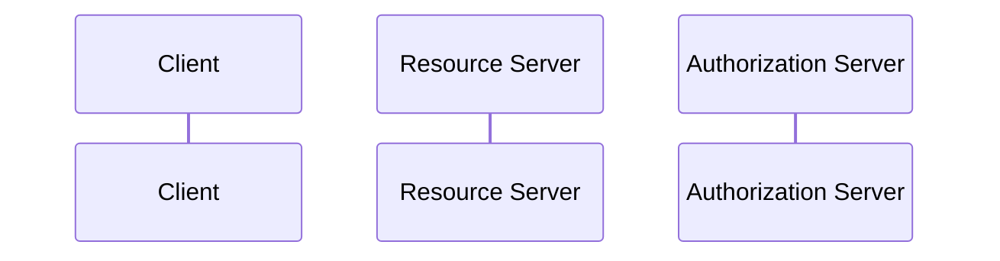

> Welche Aktionen darf die App im Namen des Users ausführen?
> [[RFC]] 6749
> [[RFC]] 9700

[[Authentifizierung vs Authorisierung|Auth]] 
- seit 2010 als [[RFC]] 

> [!warning] Es geht nur um **Authorization** von Access auf third parties -> **Nicht** darum, user Information zu verteilen!
> [[Keycloak]] macht das per default falsch lol

> [!warning] [[JWT]] ist tatsächlich _nicht_ vorgeschrieben von OAuth!

> [!hint] Am Besten für ordinären [[Internet]] traffic, ohne viel Confidentiality

### Rollen
- Authorization [[Server]]
- [[Resource Server]] -> Das, was der User accessen will (ne [[API]] idr)
- [[Client]]

=> [[Client Server Architecture]]

## Ablauf

> [!hint] uses [[HTTP POST]] für obtaining a token, weil GETs eher in Browser history landen

- Zwischenschritt [[Authorization Code]] => soll es Angreifern schwierriger machen, weil sie mehr Request machen
- [[Refresh Token]], damit es nicht so schlimm ist wenn ein [[Access Token]] geklaut ist
- [[Client Secret]] -> ne Art Passwort

## Endpunkte
- Introspection Endpoint: Token hinschicken, zurück bekommen, was damit verbunden ist