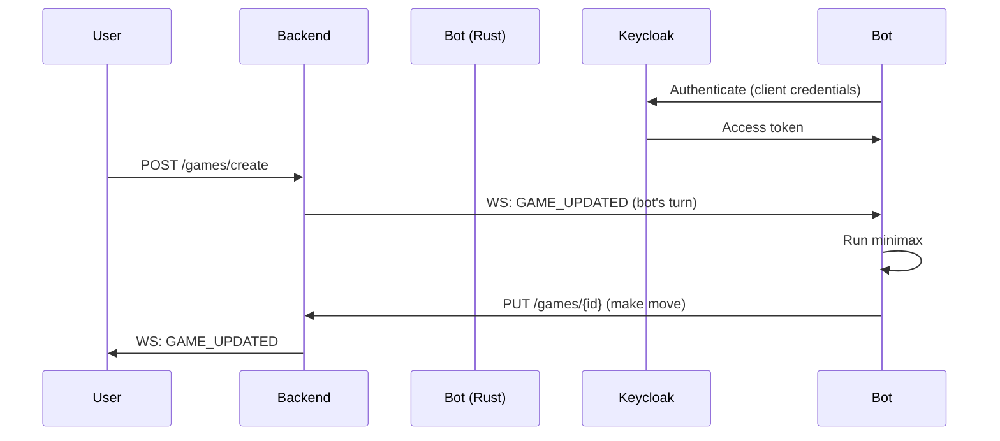
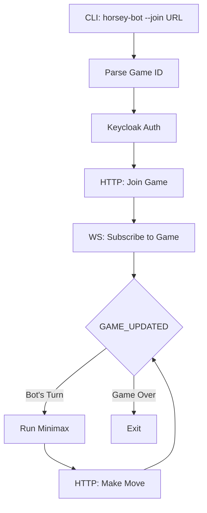

## Sequence Diagram Bot-as-user

```mermaid
sequenceDiagram
    participant User
    participant Backend
    participant Bot (Rust)
    participant Keycloak
    
    Bot->>Keycloak: Authenticate (client credentials)
    Keycloak->>Bot: Access token
    User->>Backend: POST /games/create
    Backend->>Bot: WS: GAME_UPDATED (bot's turn)
    Bot->>Bot: Run minimax
    Bot->>Backend: PUT /games/{id} (make move)
    Backend->>User: WS: GAME_UPDATED

```

## Workflow

```mermaid
graph TD
    A[CLI: horsey-bot --join URL] --> B[Parse Game ID]
    B --> C[Keycloak Auth]
    C --> D[HTTP: Join Game]
    D --> E[WS: Subscribe to Game]
    E --> F{GAME_UPDATED}
    F -->|Bot's Turn| G[Run Minimax]
    G --> H[HTTP: Make Move]
    H --> F
    F -->|Game Over| I[Exit]
```