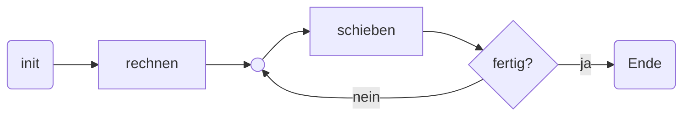

- benötigt nur _einen_ [[Volladdierer]]
- benötigt Speicher für Carry --> ein [[SR-Flipflop]] reicht
- [[Schieberegister]] halten Eingabewerte

> [!hint] Ist eine [[ALU]] in abgespeckter Version
> [[Volladdierer]] ist die [[ALU]], der Rest sind Register; Steuerwerk ist nicht gezeichnet
## Aufbau
![[Pasted image 20240919104943.png]]

####  Zeibedarf
$$i \cdot (t_{VA} + t_{schieben})$$

> [!warning] Startwert wird überschrieben !!

### Ablauf
1. init: Schieberegister füllen; Speicher  $T$ löschen ([[Flipflops]] reset)
2. rechner: $VA: X + Y + u = c|s$ => $a_{0} + b_{0} + u = c|s$
3. schieben:
	1. $VA.s$ nach $A_{i-1}$ 
	2. $B_{i}$ nach $B_{i-1}$
	3. $VA.c$ nach $T$ (carry)
4. ... (bis alle $i$ Stellen abgearbeitet sind)
5. Endbelegung: $A$ hält Ergebnis; $T$ den Übertrag

## Mit Ergebnisregister
obige Zeichnung ist [[Akkumulator|Akkumulator]] Machine - $A$ ist [[Akkumulator]]

![[Pasted image 20240205160626.png]]
#### Zeitablaufdiagramm
![[Pasted image 20240205164415.jpg]]