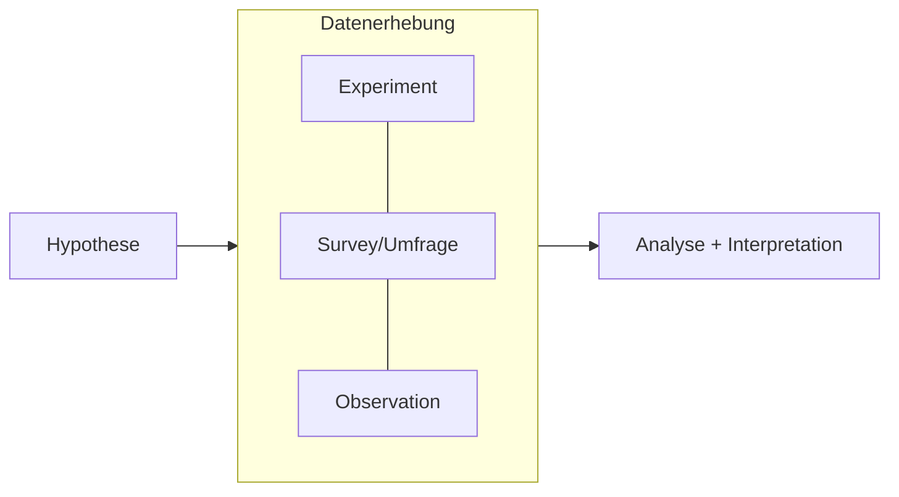

```mermaid
flowchart LR
	subgraph B1[Datenerhebung]
		direction TB
		X[Experiment] --- Y[Survey/Umfrage]
		Y --- Z[Observation]
	end
A[Hypothese] --> B1
B1 --> C[Analyse + Interpretation]
```

[[Experiment]]
[[Hypothese]]
