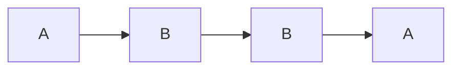

Problem mit Interner Validität: gut kontrollierte Bedingungen --> "künstliche Welt"

### Within-Subject
#### Position der Fälle
In welcher Reihenfolge die zwei verschiedenen Tests durch geführt wird, hat Effekte!!!

#### Lösung: Randomisierung der Reihenfolgen
##### ABBA Balancierung

##### Latin Square
ABCD
BDAC
CDBA
CADB

==> Jedes Experiment ist in genau in jeder Position einmal

#### Carry-Over Effect
Es ist möglich, dass der Einsatz des ersten Versuchs den zweiten unmöglich macht