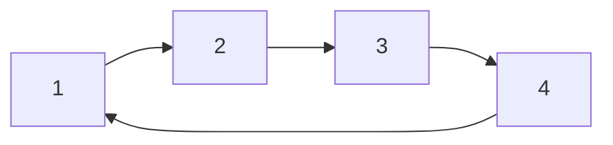
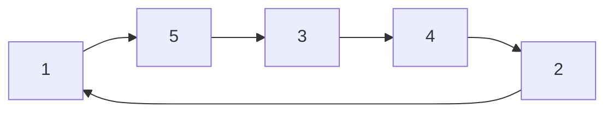

[[Travelling Salesman Problem]]
TSP hat überlappende Teilprobleme, aber _keine überlappende Substruktur_!!

Es ist möglich, dass bester Weg von 1-4 über 

gegeben ist, aber für 1- 5 über

Liegt daran, dass der TSP-Graph ein [[Gewichteter Graph]] ist.
