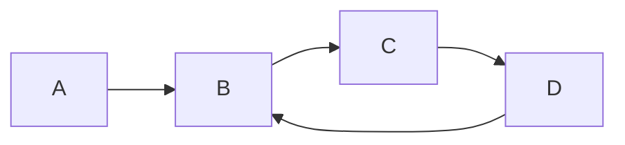

A [[Liste|list]], where a [[Knoten|Node]] points back to the node



### Erkennen von circular list
--> Algorithmus von Hase und Igel
Idee: Ein [[Pointer]] läuft doppelt so schnell wie der andere --> wenn die [[Pointer]] gleich sind, 
```python
def is_cyclic(list):
	hase, igel = list
	while True:
		for _ in range(2):
			hase = hase.next
			if not hase:
				return False
		igel = igel.next
		if hase == igel:
			# list is cyclic
			return True
```
