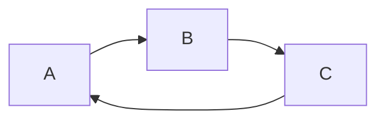

Part of [[JVM]]
- gets triggered periodically
- when triggered, searches for [[Object|objects]] in [[Java Heap|Heap]] that aren't needed anymore and frees their memory

### Process
note: very _naive_ garbage collection
```python
def when_triggered():
	for object in heap:
		if not exists(reference(object)):
			free(object)
			
```
(lol it's kinda funny how I'm incorporating c and Prädikatenlogik into my pseudo codes)

#### Problem: Circular references

If these are not referenced anywhere from the main program, the naive algorithm does not detect those as not needed
--> modern iterations of [[JVM]] got a lot better at this

##### fix lol
Just do 
```java
B = null;
```
--> now, C does not have a reference to it anymore


### Example Triggers
- space of [[Java Heap]] running low