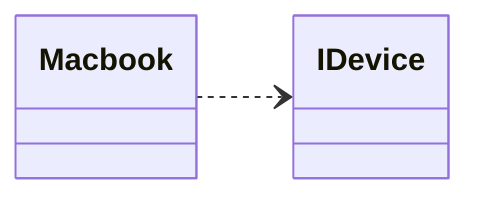

> Alternative solution to [[Abstract Class|Abstract Classes]] and Class [[Inheritance]]:
>[[Abstract Class]] is [[Abstraction]], [[Interface]] is specification.

- Can be understood as a **Role** of a [[Class]]
- one Class can implement multiple interfaces
- Defines only public [[Methode|methods]] and [[final modifier|final]] constants.
	- (the `static final` modifier is put there automatically by the compiler)
- However: [[Default Implementation Interface]]

=> Can be used to deal with specific aspects of an [[Object]] without needing to take any extra information about that Object into account

> [!hint] Differentiate Abstract Classes and Interfaces
> - speak: X _is_ Y --> Y is [[Abstract Class]]
> - spek: X _can do_ Y --> Y is [[Interface]]

## in Java
An [[Interface]] declares a set of Methods, a [[Class]] has to implement.

A [[Class]] implementing an [[Interface]] $i$ is [[Datentyp|Type]] compatible with all other classes implementing $i$. 
> [!hint] Interfaces can be [[Inheritance|inherit]] from other Interfaces
> ```java
> public interface Interface1 extends Interface2
> ```
> 


```java
interface IDevice {
	public Processor getProcessor(Processor proc);
}


class Macbook implements IDevice {
	public Processor getProcessor(Processor proc) {
		return M1;
	}
}
```
## in UML
--> Arrow should be dotted lol

![[Pasted image 20240507162914.png]]