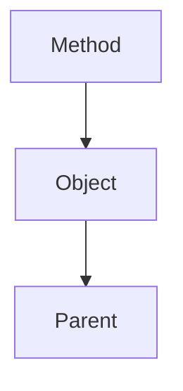

Resolve Variables from the inner-most scope to the outside



> [!warning] Each step is evaluated anew!!
> Even from a method in a parent class, the child class will be searched first (assuming, the method got called from the child class)
### Escape scopes
```java
this.variable
```
skips Method scope and resolves in Class/Object scope.

#### Parent scope
```java
super.variable
```

skips Metehod and Object scope and searches in the Parent Class.
> [!warning] Is not chainable!
> `super.super.variable` is _not_ permitted!