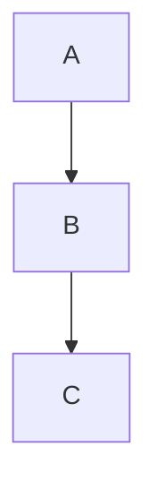

> greek for "of many forms"

[[Class]] [[Inheritance]]

Let $A$ be a Parent class, and $B$ and $C$ child classes of different depths to $A$.


Polymorphism describes the ability for a variable of data type $A$ to hold any object of a child class of $A$.

```java
A var = new C();
```


### Late Binding
Which Method will be executed is only decided at _Runtime_, as that depends on the type of Object passed in.