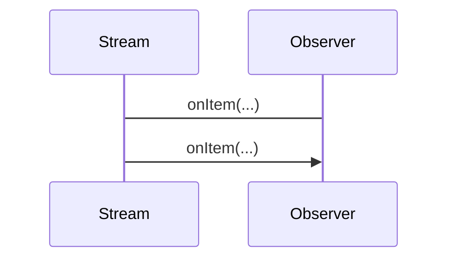

> combines [[Functional Programming]], the [[Observer Pattern]] and [[Iterable]] pattern.

> [!hint] Eveyrthing is a [[Java Stream|Data Stream]].

- Observe Streams and do stuff when _something_ flows in the stream (i.e. is [[Observer Pattern|observed]])

