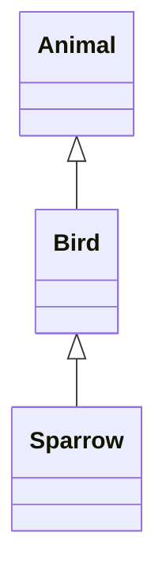

- Works with [[Reference|References]] by changing the _perspective_ 



### Upcast
in Vererbungs-Hierarchie nach _oben_
- ist immer Problemlos möglich

```java
Sparrow s = new Sparrow();
Animal animal = s;
```

### Downcast
In Vererbungs-Hierarchie nach _unten_
Benötigt _expliziten_ Cast 

> [!warning] Funktioniert _nur_, wenn [[Object]] ursprünglich als richtiger Typ erstellt wurde!!
> otherwise, java throws an Exception

Funktioniert genau dann, wenn [[instanceof]] zur gewollten Klasse $true$ zurück gibt

```java
Animal animal = new Animal();
Sparrow sparrow = (Sparrow) animal;
```