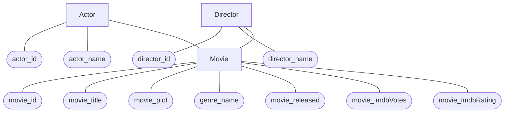
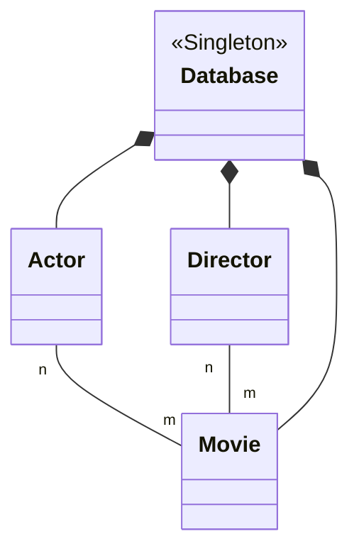

result of [[grep]] on the file:
```bash
grep "New_Entity" movieproject2024.db
New_Entity: "actor_id","actor_name"
New_Entity: "movie_id","movie_title","movie_plot","genre_name","movie_released","movie_imdbVotes","movie_imdbRating"
New_Entity: "director_id","director_name"
New_Entity: "actor_id","movie_id"
New_Entity: "director_id","movie_id"
```

### ERM of Persons
Okay I see mermaid has its limitations



### UML
Okay fuck it what classes do I need

- [ ] Actor
- [ ] Movie
- [ ] Director
- [ ] Actor-Movie
- [ ] Director-Movie (bro dafuqfuq)
- [ ] Database




