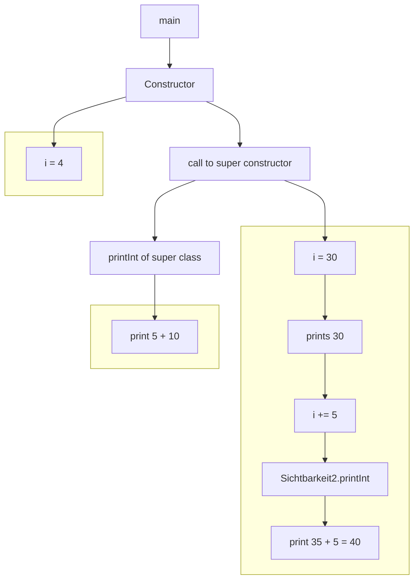

![[2023-Java-Slides.pdf#page=81]]

[[Inheritance]], [[Polymorphism]], [[Java Scopes]], 


## What actually happens


and so on idgaf anymore
Mermaid is _kinda_ cool but lacks fine-grained control

idk it's 5 - 40 - 15 - 16 for some fucking reason

## My own wrong solution
![[Pasted image 20240521144802.png]]
(the last step forgot that the `printInt()` method adds another 5 to the input lol
### Output
Okay bro fuck you forgot the call to the Default Constructor of the parent
```
15
16
```