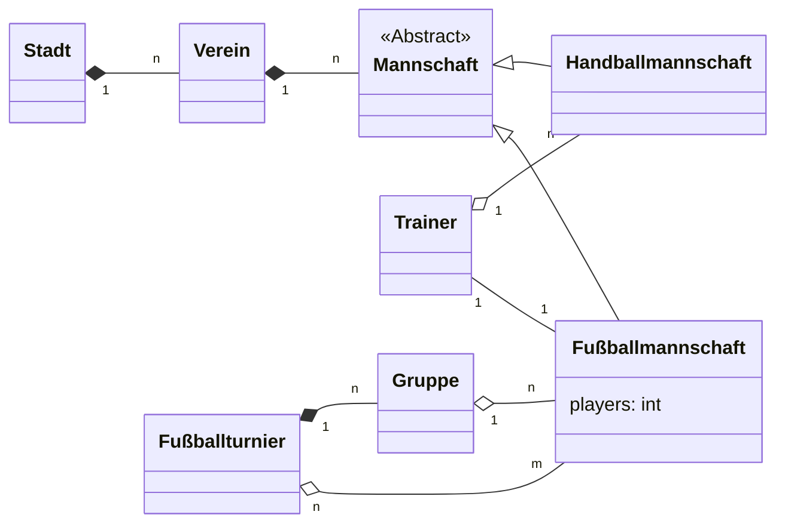

> For se Mermaid: https://mermaid.js.org/syntax/classDiagram.html

In einer Stadt gibt es Vereine, wobei ein Verein aus mehreren Mannschaften besteht. Eine Mannschaft ist z.B. eine Fußballmannschaft oder eine Handballmannschaft. Jede Mannschaft besteht aus einer Anzahl Spielern. Ein Trainer trainiert eine Mannschaft. In einem Fußballturnier gibt es mehrere Gruppen, die wiederum aus mehreren Fußballmannschaften zusammen gesetzt sind.

--> learning more mermaid here we go lol
