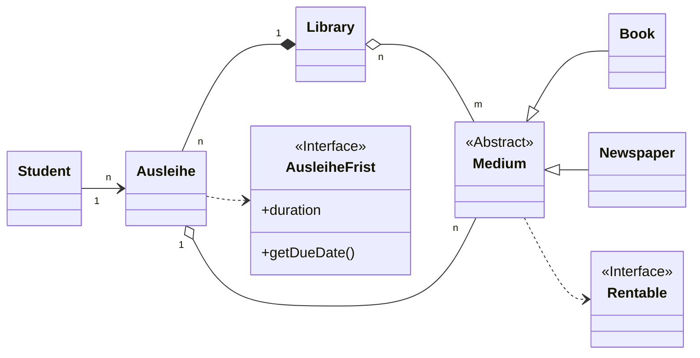

- Bibliothek besitzt Bücher und Zeitschriften, welche an Studenten ausgeliehen werden
- Um die Ausleihfrist zu überprüfen wird notiert, wann etwas ausgeliehen wird

```mermaid
classDiagram
	direction LR

	Medium <|-- Book
	Medium <|-- Newspaper

	Library "n"o--"m" Medium
	Medium ..> Rentable

	Student "1"-->"n" Ausleihe
	Ausleihe "1"o--"n" Medium
	Ausleihe "n"--*"1" Library
	Ausleihe ..> AusleiheFrist


class Rentable {
	<<Interface>>
}

class AusleiheFrist {
	<<Interface>>
	+duration
	+getDueDate()
}

class Medium {
	<<Abstract>>
}

```
