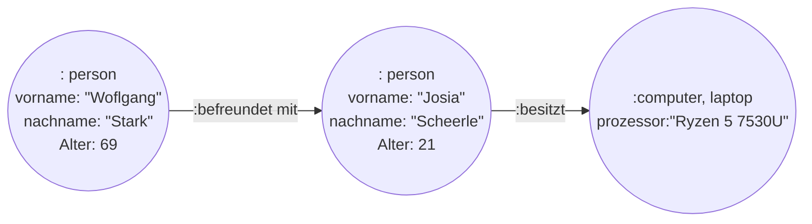

```mermaid
flowchart LR
A((: person\nvorname: &quot;Josia&quot;\nnachname: &quot;Scheerle&quot;\nAlter: 21))

B((: person\nvorname: &quot;Woflgang&quot;\nnachname: &quot;Stark&quot;\nAlter: 69))

C((:computer, laptop\nprozessor:&quot;Ryzen 5 7530U&quot;))

B --:befreundet mit--> A
A --:besitzt--> C

```

