```mermaid
flowchart LR
A((: person\nname: &quot;Jürgen&quot;\nAlter: 21))

B((: person\nname: &quot;Mario&quot;\nAlter: 42))

C((:computer, laptop\nmarke:&quot;Dell&quot;))

B --:befreundet mit--> A
A --:besitzt--> C

```

## Query
"Welche von Marios Freunden haben einen Laptop?"

```cypher
MATCH (mario:Person {name: "Mario"})-[:BEFREUNDET_MIT]->(friend:Person)-[:BESITZT]->(laptop:computer:laptop)
RETURN friend.name;
```

```sql
SELECT DISTINCT p2.name
FROM Person p1
JOIN Friendship f ON p1.id = f.person1_id
JOIN Person p2 ON f.person2_id = p2.id
JOIN Ownership o ON p2.id = o.person_id
JOIN Computer c ON o.computer_id = c.id
WHERE p1.name = 'Mario' AND c.type = 'laptop';

```

[[queries.cypher]]