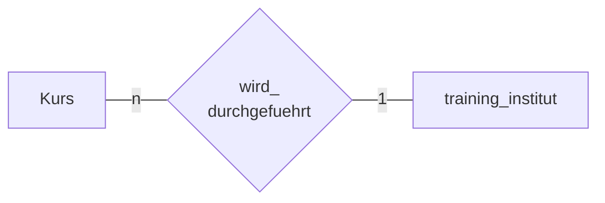

> Verändern der unterliegenden [[SQL View]]

- Neue [[Relation]] wird erstellt -> `Training_Institut`




- überschreibt pre-existing view
- Schlussendlich ist informationsgehalt gleich

```sql
create view mitarbeiter_besucht_kurs
as
select pers_nr, vorname, nachname, kurs_bez, institut
from kurs
natural join besucht_kurs
natural join mitarbeiter
natural join training_institut;
```