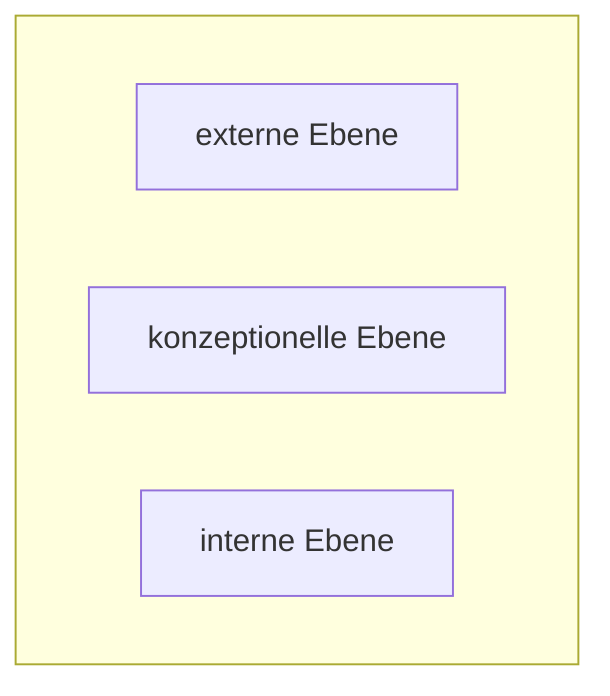

### externe Ebene
Benutzeroberfläche, [[Benutzersicht|Benutzersichten]], Schnittstellen

Erfolgt mithilfe von [[Benutzersicht|Benutzersichten]] 

### konzeptionelle Ebene
Tabellen und [[Relation|Beziehungen]]

### interne Ebene
Dateiorganisation und Zugriffspfade auf die Daten, Details der Datenspeicherung

