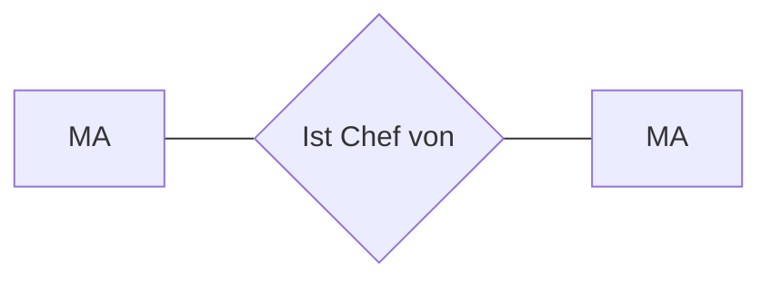

[[Relationship]], [[Recursion]]

- Eine [[Entität]] steht in einer [[Relationship|Beziehung]] mit sich selbst

> [!hint] Können auch als Binäre Beziehung modelliert werden, ist aber unübersichtlicher
## Beispiel
![[Pasted image 20241001150549.png]]

#### als Binäre Beziehung

