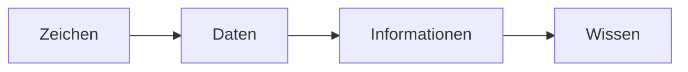

Beispiel Gehirn: 
1. Daten: Schmerz an rechtem Arm
2. Information: ich werde geschlagen
3. Wissen: Niko ist ein Idiot

---

Zeichen: [[Alphabet]]
[[Daten]]: [[Syntax|Syntaktisch]] korrekt
[[Information]]: [[Semantik|Semantisch]] korrekt

> [!warning] Aufgabe einer [[Datenbank]] ist es, aus Daten Informationen zu machen!

## Fancier Diagram lol
![[Pasted image 20240918170913.png]]