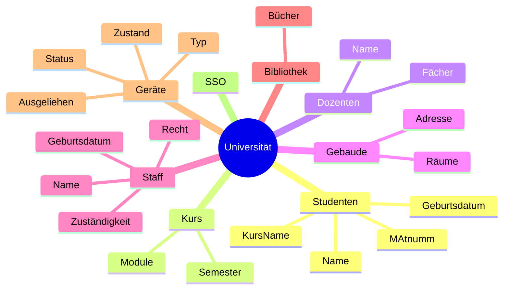

### 1. Welche Daten fallen an
- Studenten
	- Matr. Nr
	- Name
	- Geburtsdatum 
	- in welchen Kurs?
	- email...
- Kurs
	- welches Semester
	- welche Module
- Dozenten
	- Name
	- welche Fächer
- Anderer Staff (Sekretiariat, Studiengangsleitung)
	- Name
	- Rolle
	- Gerburtsdatum
- Universität an sich
	- Räume
	- Adresse
	- mehrere Gebäude
- Bibliothek
	- Bücher
- Geräte
	- typ
	- ausgeliehen am

### 2. Welche Benutzergruppen
[[Benutzersicht]]
- Super Admin
- Sekretariat
	- Kurse
- Studenten
- Dozenten
- Staff
	- Sekretariat
	- Bibliothekenstaff

### 3. Welche Anwendungsprogramme?
- Stunden- und Raumplan
	- Klausuren
- Notenübersicht
	- Notenverwaltung
- Studentenverwaltung
- Geräteverleih
- [[SSO]]
- Büchereiverwaltung
	- Ausleihe
	- Suche

### 4. Wie würde erforderliche Funktionalität ohne DBMS realisiert werden? Welche Auswirkungen hätte dies für die Daten?
- RIESIGE JAVA KLASSEN
- OBJECTE ORIENTED PROGRADMIKNINEING 🦅🦅🦅🗣📣📣📣🦅🦅🦅🦅
- nen haufen CSV Dateien und System, das mit ihnen kommuniziert 
- **nicht-digital (Ordner, Karteikästen etc.)**

==> im endeffekt ein Pseudo-[[DBMS]] selbst schreiben (mit SPI und allem)

#### Fehler
- viel [[Redundanz]]
- viel Suchen, Risiko es gar nicht zu finden
- Datenverlust
- langsame Datenverwaltung
- inkompatible Datenformate

