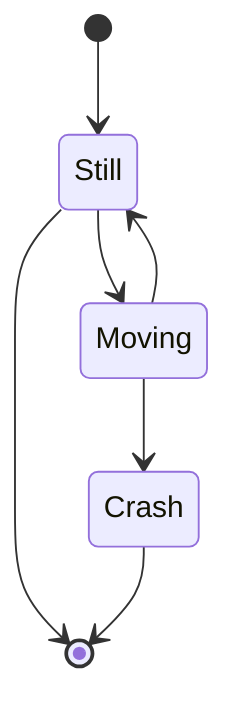
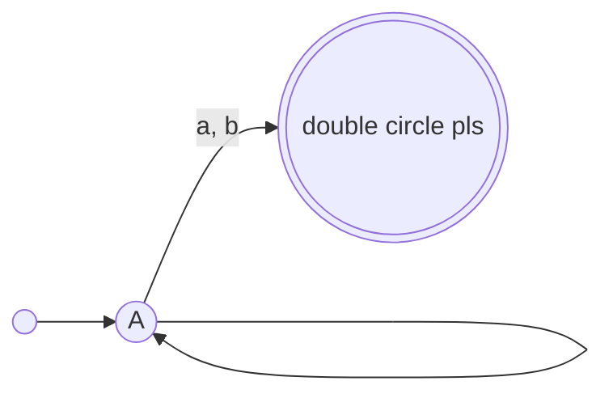

```mermaid
stateDiagram-v2
    [*] --> Still
    Still --> [*]

    Still --> Moving
    Moving --> Still
    Moving --> Crash
    Crash --> [*]
```

```mermaid


flowchart LR
	0(( )) --> A((A))
	A --> A
	A --"a, b"--> C(((double circle pls)))
```

- Essentially regular Flowchart
- type: `stateDiagram-v2`
- Start-and End state: `[*]`
	- which one is determined by whether arrows arrive or leave

---
