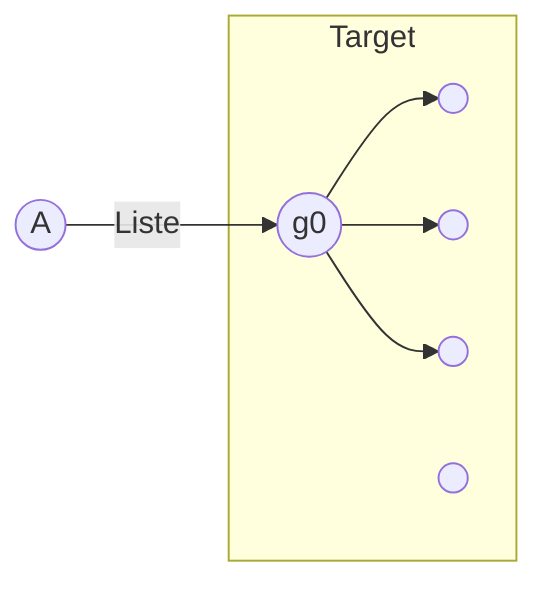

> Punkt-zu-Punkt-aus-Gruppe

```mermaid
flowchart LR
	A((A)) --Liste--> g0((g0))
	subgraph Target


		g0 --> B(( ))
		g0 --> C(( ))
		g0 --> D(( ))
		E(( ))
	end
```

- Gruppe $G$ aus Empfängern
	- Daten wird nur an _ein_ $g_0 \in G$ gesendet
	- $g_0$ verteilt [[Daten]] an _alle anderen_ $g_{i} \in G$