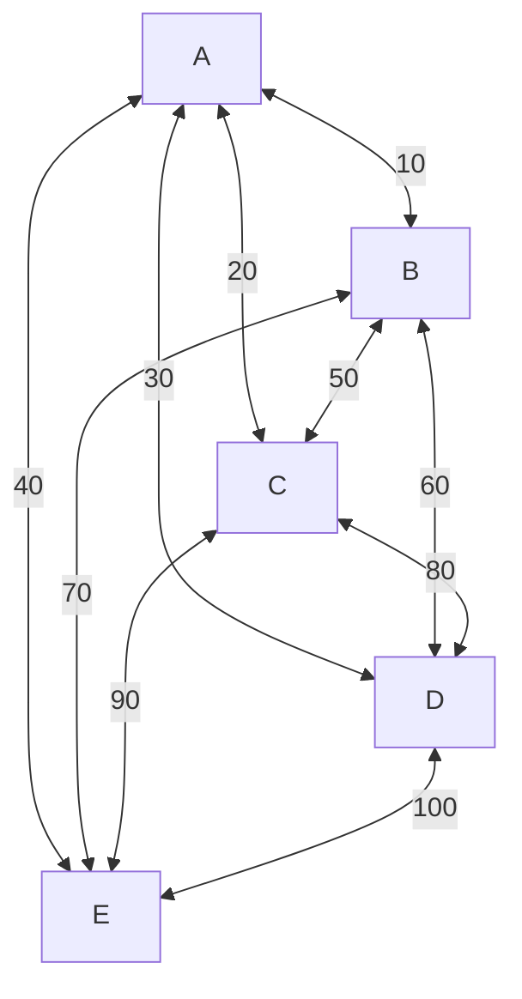
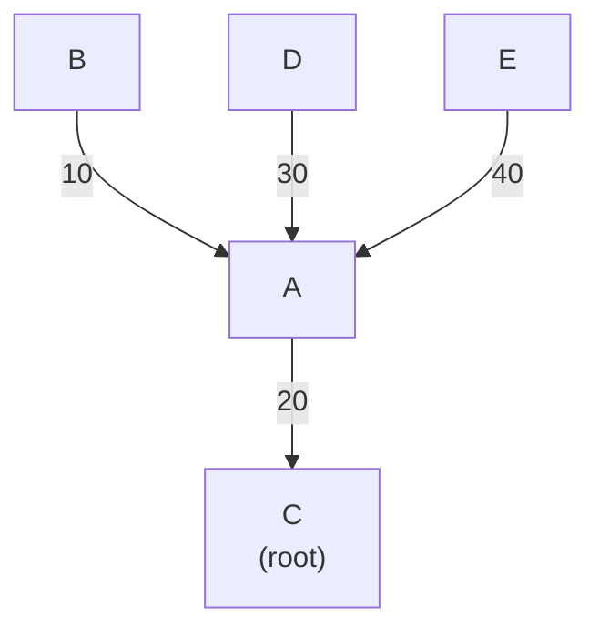

Autor: Emil Schläger
Matrikel-Nummer: 2988631
Kurs: INF23B

<div style="page-break-after: always;"></div>
### Projektbeschreibung
Im Zuge des Moduls 'Labor Netztechnik' des zweiten Studienjahrs Informatik an der DHBW Stuttgart wurde ein Programm entwickelt, welches den Spanning-Tree Algorithmus von Switchen in einem Layer 2 Netzwerk simuliert. Um der Realität möglichst nahe zu kommen, wurde ein Threading-Ansatz gewählt. Jeder Switch läuft in einem eigenen Thread, und kann nur mit den Threads kommunizieren, in denen benachbarte Switches laufen. Als Programmiersprache wurde Python gewählt.

### Konfiguration und Ausführung
Instruktionen zum Ausführen und Konfigurieren der Simulation entnehmen Sie bitte dem beigelegten README.

### Dokumentation
#### Dateistruktur
Im Folgenden wird die Rolle der einzelnen Dateien im Groben aufgezeigt.
```
├── config.py
├── main.py
├── models
│   ├── bpdu.py
│   └── switch.py
├── network.yml
├── README.md
└── requirements.txt
```

- `config.py`: Zuständig für das korrekte Laden und übertragen der YAML-Datei in interne Datenstrukturen
- `main.py`: Zentraler Koordinator. Startet und Stoppt die Threads der Switches.
- `models/bpdu.py`: Simple Python Klasse, die eine BPDU abstrakt modelliert mit den Headern, die für die Simulation benötigt werden
- `models/Switch.py`: Python Klasse, die einen Switch modelliert. Hier befindet sich die meiste Logik.

#### Klasse BPDU
Ein BPDU-Objekt wird von einem Switch erstellt, um mit anderen Switches zu kommunizieren. Jede BPDU speichert:
- `sender`: Von welchem Switch die BPDU stammt
- `root_switch`: Welcher Switch von `sender`  als Root-Switch gesehen wird
- `root_costs`: Wie teuer der Weg zu `root_switch` ausgehend von `sender` ist

#### Klasse Switch
Jeder Switch wird beschrieben durch eine `given_id` (der Name, der dem Switch in der YAML gegeben wurde), einer MAC Addresse `mac_address` und einer Priorität. Jeder Switch merkt sich den aktuellen Root Knoten (`root_switch`), sowie über welchen Nachbarn dieser Root Switch erreichbar ist (`root_port`). Für die Kommunikation mit anderen Switchen besitz jeder Switch eine thread-safe Queue, in die andere Switche BPDUs schreiben. 

##### Methode `__lt__`
Diese Methode definiert die Kleiner-Als-Relation auf Switch-Objekten. Dies ermöglicht einen einfachen Vergleich zwischen Switchen A und B durch den Syntax `A < B`. $A \lt B$ für zwei Switche gilt genau dann, wenn:
1. `A.priority < B.priority`
2. oder `A.priority = B.priority` $\land$ `A.mac_address < B.mac_address`.

##### Methode `send_bpdu`
Diese Methode deponiert eine BPDU des sendenden Switches in der Message Queue jedes Nachbarn.

##### Methode `process_bpdu`
Diese Methode konsumiert eine BPDU aus der Message Queue. Die Switch-interne Information über den Root-Knoten wird aktualisiert, wenn die BPDU eine der folgenden Bedingungen erfüllt:
- `BPDU.root_switch < self.root_switch` (sprich: ein Besserer Root Switch wurde gefunden)
- `BPDU.root_costs < self.root_costs`, falls die Root Switche gleich sind. (Sprich: Ein Besserer Weg zum Root wurde gefunden)

Wird eine Verbesserung identifiziert, wird eine entsprechende Information in die Konsole ausgegeben.
##### Methode `run`
Dies ist die Hauptroutine jedes Switches. In ihr werden für $n$ Iterationen alle $t$ Sekunden eine BPDU an alle Nachbarn des Switches geschickt. $n$ und $t$ sind hierbei konfigurierbar in `network.yml` als Umbebungsvariablen `iterations` und `timeout`. Nachdem eine BPDU broadcasted wurde, konsumiert ein Switch alle Nachrichten in seiner eigenen Message Queue, bevor der Thread die parametisierten $t$ sekunden schläft.


### Beispiel
Hier wird eine Beispielkonfiguration von 5 Switchen gezeigt. Anschließend wird der Runtime-Output, sowie der finale Output gezeigt und beschrieben.

#### Konfiguration
```yaml
env:
  iterations: 10
  timeout: 1

switches:
  a:
    mac: "11:11:11:11:11:11"
  b:
    mac: "22:22:22:22:22:22"
  c:
    mac: "33:33:33:33:33:33"
    priority: 10000
  d:
    mac: "44:44:44:44:44:44"
  e:
    mac: "55:55:55:55:55:55"
edges:
  a:
    b: 10
    c: 20
    d: 30
    e: 40
  b:
    c: 50
    d: 60
    e: 70
  c:
    d: 80
    e: 90
  d:
    e: 100
```
Hier wird die Simulation konfiguriert auf 10 Iterationen mit einem Timeout von 1. Es sind 5 Switche gegeben, jeweils alle miteinander verbunden. Da für 4 der Switche keine Priorität konfiguriert ist, besitzen diese die default Priorität von $32768$.



#### Runtime Output
```
[a] Started
[b] new root: a
[b] new root costs: 10 via a
[b] Started
[c] Started
[d] new root: a
[d] new root costs: 30 via a
[d] new root: c
[d] new root costs: 80 via c
[d] Started
[e] new root: a
[e] new root costs: 40 via a
[e] Started
[e] new root: c
[e] new root costs: 90 via c
[a] new root: c
[a] new root costs: 20 via c
[b] new root: c
[b] new root costs: 50 via c
[b] new root costs: 30 via a
[d] new root costs: 50 via a
[e] new root costs: 60 via a
[a] done
[b] done
[d] done
[c] done
[e] done
```

An diesem Output sieht man, welcher Switch wann seine Information über den Root switch aktualisiert. Im Hinterkopf ist zu behalten, dass die Ausgabe aufgrund des Threading nicht zu 100% die tatsächliche Reihenfolge darstellt (wie am Beispiel von Switch b zu sehen ist, der dem Output zufolge zuerst seine Information aktualisiert und danach startet.)
#### Finale Ausgabe
```
All switches have finished.


Spanning Tree:
a:
  root: c via c (total cost: 20)
b:
  root: c via a (total cost: 30)
c:
  root: c
d:
  root: c via a (total cost: 50)
e:
  root: c via a (total cost: 60)
```

Dies stellt den folgenden Spannbaum dar:



Eine triviale Überprüfung durch Prims Algorithmus mit Startknoten C führt zu demselben Ergebnis. 