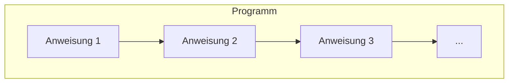

> Ein Computer führt Anweisungen der Reihe nach durch

```mermaid
flowchart LR
	subgraph Programm
		direction LR
		1[Anweisung 1] --> 2[Anweisung 2]
		2 --> 3[Anweisung 3] --> 4[...]
	end
```

- geht mehr in richtung [[Turing Machine]]
- sehr [[Definition Algorithmus|algorithmische]] Definition