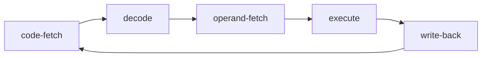

> [!warning] [[Endlosschleife]] --> Die [[CPU]] _kann_ nicht aufhören!!!!

1. `Code fetch`: [[Adress-Zähler]]  an Speicher
	1. Wert an dieser Stelle wird von [[CPU]] eingelesen
2. `Decode`: 
	1. [[CPU]] stellt fest, welche [[Instruktion]] es ist
	2. [[Adress-Zähler]] wird erhöht
3. `Operand fetch`: holen/bereitstellen der [[Variable|Variablen]]
	1. aus [[Register]], externer Speicher, Berechnungen
4. `Execute`: [[Variable|Variablen]] verknüpfen
5. `Write back`: Ergebnis zurück schreiben
6. repeat

> [!hint] Führt zu [[Pipeline]]
> - Während eine Instruktion ausgeführt wird, kann der Nächste schon geholt werden
> - Man muss nicht immer warten, bis der ganze [[Befehlszyklus]] für eine [[Instruktion]] durchgelaufen ist

[[Befehlszyklus v. Neuman vs Harvard]]