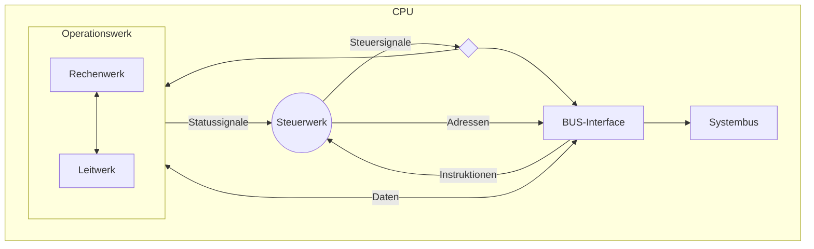

> **C**entral **P**rocessing **U**nit

[[Instruction Set Architecture]]

#todo diagram von Hand lol

```mermaid
flowchart TD
	subgraph CPU
		direction LR
		subgraph Operationswerk
			direction TB
			Rechenwerk <-->	Leitwerk

		end
		Steuerwerk --"Steuersignale" --> Steuersignale
		Operationswerk --"Statussignale" --> Steuerwerk
		Steuersignale{ } --> Operationswerk
		Steuersignale --> BUS-Interface
		Steuerwerk((Steuerwerk))

		Steuerwerk --"Adressen"--> BUS-Interface
		BUS-Interface <--"Daten"--> Operationswerk
		BUS-Interface --"Instruktionen"--> Steuerwerk
		

		BUS-Interface --> Systembus
	end
```

### Komponenten
[[Steuerwerk]]
[[Operationswerk]]