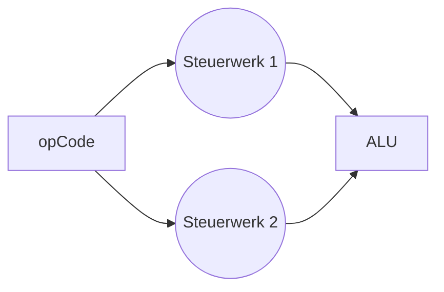

> Multiple [[Instruktion]] single [[Daten|data]]

> [!warning] Wird physikalisch nicht gebaut.

```mermaid
flowchart LR
	opCode --> S1((Steuerwerk 1))
	opCode --> S2((Steuerwerk 2))
	S1 --> ALU
	S2 --> ALU
```

Problem: Welches von den beiden [[Steuerwerk|Steuerwerken]] ist zu bevorzugen?