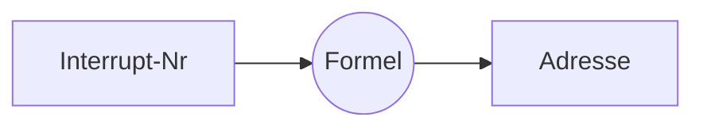

> [[Adresse]] der Interrupt Routine wird berechnet

[[Vektornummer]]

- Interrupt Acknowledte Signal [[INTA]]
	- was das macht? idfk "das gibt's halt"

> [!warning] Bähnisch meinte das "habe es übergangsweise mal gegeben"... Still relevant??

### Quellen
- Interrupt Request Eingang (INTR)

### Priorität
- Global
	- enable: Befehl `EI`
	- disable: Befehl `DI`

## Ablauf
1. Anfrage: Meldung am [[INTR]]
2. ob: am Ende jeden [[Instruktion|Befehls]]: Test des Eingangs
3. (es gibt nur eine Möglichkeit für [[Interrupt-Typen|Interrupt Typ]])
4. entscheiden: **ablehnen** wenn `disable`
5. [[Priorität Interrupt|Prio]] neu: [[Interrupt]] sperren
6. Zieladresse: 
	1. Annahme bestätigt ([[INTA]] Puls)
	2. Aufforderung: an Quelle, ein Bitmuster auf [[Datenbus]] zu legen
		1. Bitmuster $\approx$ Befehl $RST_{n} = 11nnn111$
			1. $nnn$ ist die [[Vektor]]-Nummer
	3. [[CPU]] liest Bitmuster als [[Instruktion]] --> [[Adresse]] ist $8 \cdot nnn$
7. Aufruf
8. (ausführen)
9. [[Priorität Interrupt|Prio]] zurücksetzen: [[Interrupt]] freigeben (im [[Functions|Unterprogramm]])
10. beenden: normales Return
11. Rücksprung

> [!hint] Durch 9. kann Programmierer festlegen, ab wann der Interrupt durch einen anderen Interrupt unterbrochen werden kann