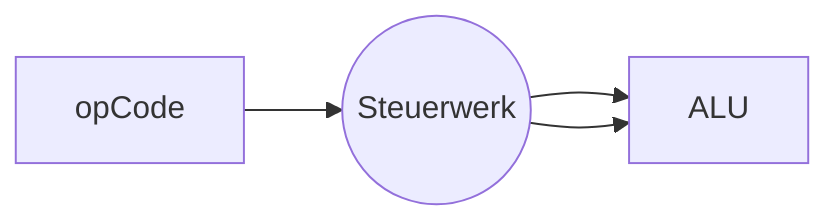

> Single [[Instruktion]] multiple [[Daten|data]]

[[Steuerwerk]], [[ALU]]

Beispiel: Rechnen mit [[LAlg 2 Vektorraum Basics.pdf|Vektoren]]
## Beispiel intel MMX
- 64 bit [[Register]]
	- 8 x 1 Byte --> 8 [[ALU]]
	- 4 x 2 Byte
	- 2 x 4 Byte
	- 1 x 8 Byte --> 1 [[ALU]]

## Beispiel Nintendo lol
![[Pasted image 20240912105030.png]]
