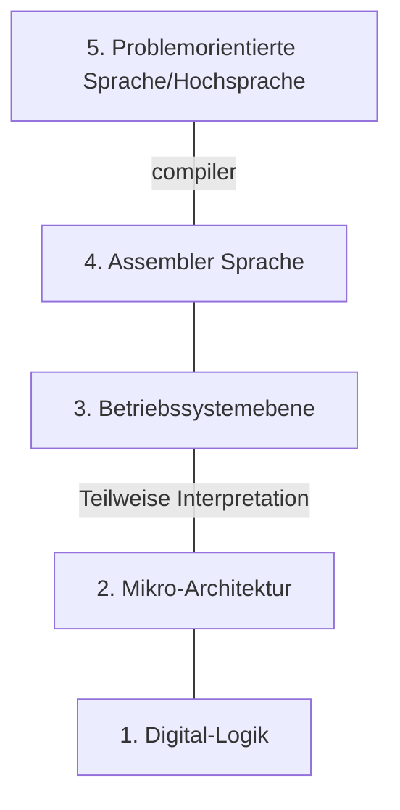

[[Hierarchie von Sprachen]]

```mermaid
flowchart TD
	5["5. Problemorientierte Sprache/Hochsprache"] --"compiler"--- 4["4. Assembler Sprache"]
	4 --- 3["3. Betriebssystemebene"]
	3 --"Teilweise Interpretation"--- 2["2. Mikro-Architektur"]
	2 --- 1["1. Digital-Logik"]
```

> [!warning] Hier ist Betriebssystem ausschließlich in [[Assemblersprache]] geschrieben  - ist natürlich eigentlich nicht der Fall