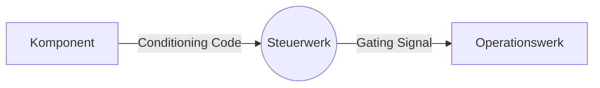

> Steuert die Abläufe einer [[CPU]]

- Input: **Statusmeldung** (engl.: "Conditioning Code"), **Instruktionen**
	- "Rechnung erfolgreich"
	- "Ergebnis negativ" ...
- Output: **Steuersignal** (engl.: "Gating Signal") --> [[Operationswerk]]

