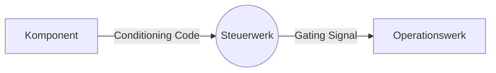

> Steuert die Abläufe einer [[CPU]]

[[Steuerwerk mit Mikroprogrammierung]], [[Steuerwerk als Automat]], [[Wilkes-Stringer Steuerwerk]]

- Input: **Statusmeldung** (engl.: "Conditioning Code", [[PSW]]), **Instruktionen**
	- "Rechnung erfolgreich"
	- "Ergebnis negativ" ...
- Output: [[Steuersignal]] (engl.: "Gating Signal") --> [[Operationswerk]]

