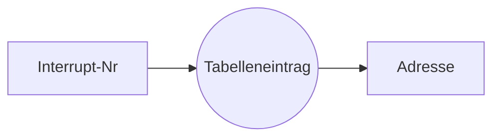

> [[Adresse]] für [[Interrupt]] Routine aus [[Lookup Table]]

[[Synchroner Interrupt]]

### Quellen
- In: Non-Maskable [[Interrupt]]
- In: Interrupt Request
- **Software**: Div by 0, [[Überlauf|Overflow]], ... [[RuntimeException]]

### Priorität
- NMI (non-maskable)
- Software: wird immer stattgegeben
- Request durch [[INTR]] (Freigabe [[Flag]])

### Umbiegen
 - ein normales Programm ändert den Eintrag der [[Lookup Table]]
## Ablauf
1. (Anfrage: Meldung am Eingang bzw. [[Flag]])
2. ob: am Ende jeden [[Instruktion|Befehls]]
3. welcher [[Interrupt-Typen|Typ]]: INTR/NMI/Software (according to [[Lookup Table]])
4. entscheiden:
	1. NMI, Software: **immer** stattgeben
	2. [[INTR]] nur wenn freigegeben
5. [[Priorität Interrupt|Prio]] neu: Freigabe aufheben / sperren
6. Zieladresse ermitteln
	1. Nummer Ermitteln
		1. Software hat feste Nummer (s. u.)
		2. NMI hat feste Nummer $2$
		3. [[INTR]] erfordert Nachfrage an Gerät
			1. Annahme des Interrupts bestätigen ([[INTA]] Puls $1$)
			2. Annahme _nochmal_ bestätigen ([[INTA]] Puls $2$)
			3. Gerät legt Vektornummer auf [[Datenbus]] ($8$ [[Bit]])\
	2. lesen der [[Interrupt]]-[[Adresse]] aus [[Lookup Table|Tabelle]]
		1. [[Adresse]] des Eintrags: $4 \cdot Vektornummer$
7. Aufruf, ausführen, beenden durch [[RETI]]
8. Priorität zurück (Interrupt-Freigabe durch IRET)
9. Rücksprung

> [!hint] Hier werden alle $8$ [[Bit]] der Vektornummer auf den [[Datenbus]] gelegt (nicht nur $3$ wie bei [[Nummer-Interrupt]] => $256$ mögliche Vektornummern

> [!info] [[Lookup Table]] liegt im [[Memory|Hauptspeicher]] --> es muss sich wieder das [[Betriebssystem]] drum kümmern, die aufzubauen