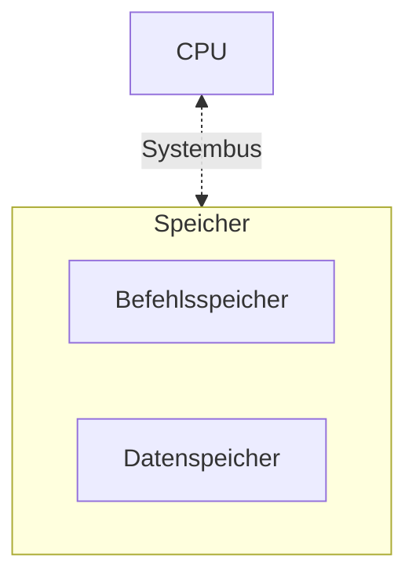

> Auch _Princeton_-Architektur

[[Minimalsystem]], [[Memory]]

- Nur ein Adressraum (= ein Hauptspeicher)
	- ob da ein Befehl oder Daten steht ist Sache des Programmierers
- ein primäres [[BUS-System]]

### Eigenschaften
- Kompiliertes Programm ist ausführbar (contrary to [[Harvard-Architektur]])
- Programme können von SSD geladen werden
- _Sequentielle_ Kommunikation mit [[CPU]]

> [!warning] weniger performant, dafür allgemeiner einsetzbar

## Beispiel

![[Pasted image 20240909111637.png]]