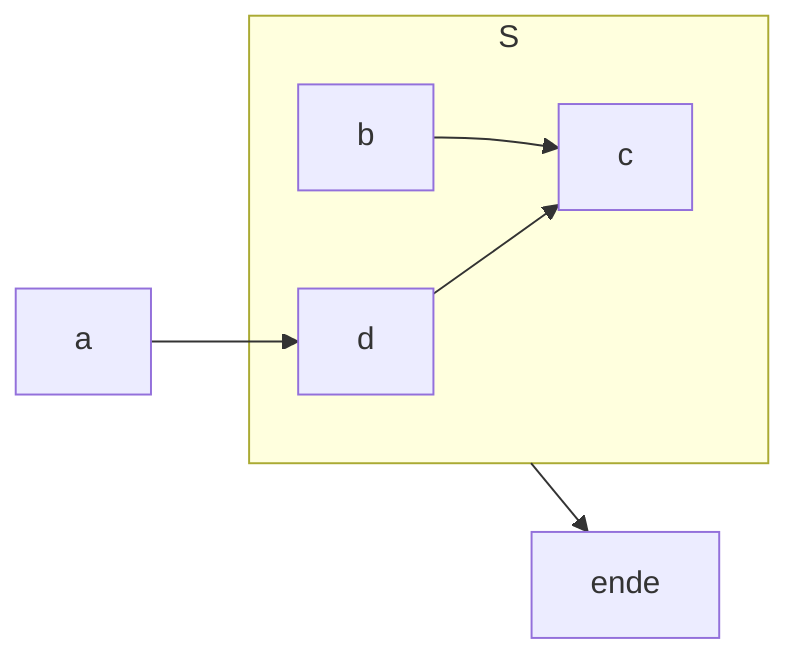
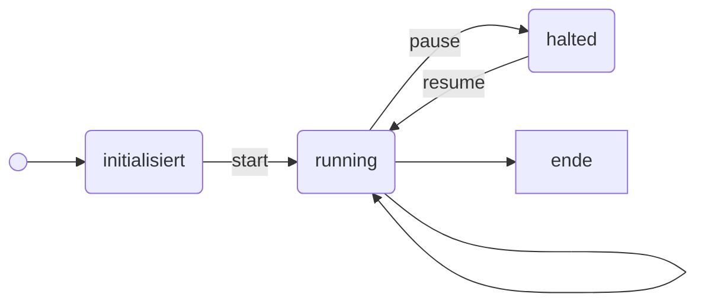

- bewegt Gäste


```python
def neighbouring_cells(pos: tuple) -> list[3][3];
def find_max_value_no_collisions(neighbours: list[3][3]) -> tuple;

def execute_steps(iterations: int):
	for i in range(iterations):
		if stopped:
			current_iteration = i
			return
		for guest in guests:
			neighbours = neighbouring_cells(guest.position)
			for cell in neighbours:
				cell.value = guest.calculate_comfort()
		guest.move(find_max_value_no_collision(neighbours))
		backup_state()
```






## simulation.yml
```yml
guests:
	- johannes:
		nachname: unterstein
		
```

