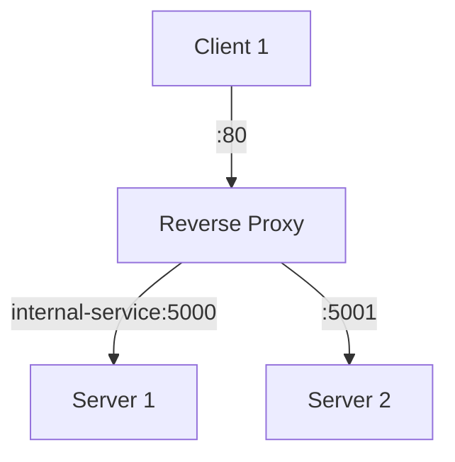

```mermaid
graph TD
    Client2[Client 1]
    RP[Reverse Proxy]
    S1[Server 1]
    S2[Server 2]

    Client2 --:80--> RP
    RP --internal-service:5000--> S1
    RP --:5001--> S2

```

- [[Interface]] between public internet and [[Service|Services]]