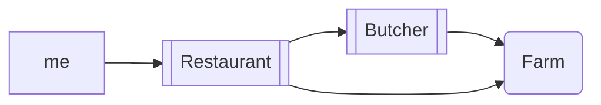

[[Cloud_Computing_Introduction.pdf#page=13]]

## Hamburger example
1: Complete Service -> go to the restaurant

### Musterlösung
![[Pasted image 20250310181112.png]]

- **CapEx** = Capital Expense (~ Investment)
- **OpEx** = Operational Expense
- on your own -> needs a lot of investment; but pay less per meal
- in Restaurant: now investment, but pay more per meal