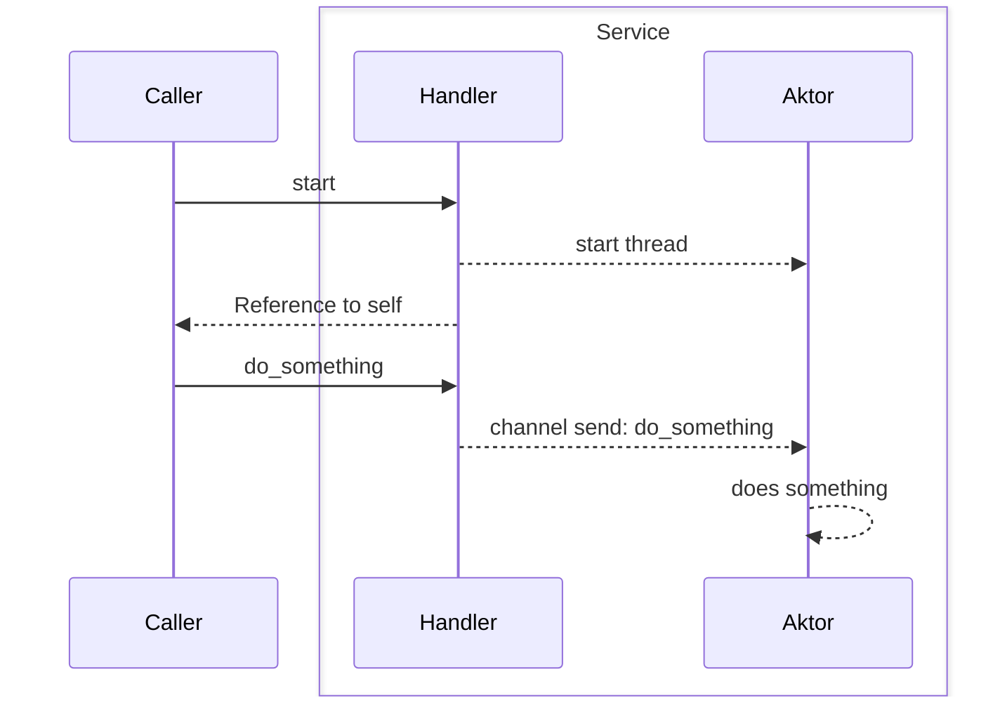

> Provide handlers to [[Thread|Threads]] 
> An abstraction around a [[Message-based Kommunikation|message-based communication]] between threads

- Thread $A$ holds a handler to Thread $B$
- if $A$ wants $B$ to do something, it calls an [[API]] method on $A$'s handle

