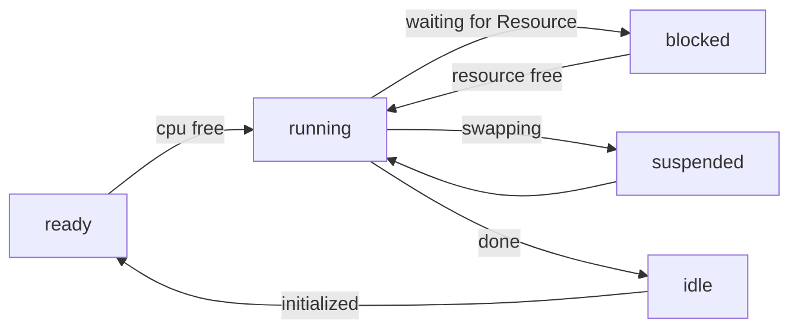

## Klassifizierung von Betriebssystemen
### nach Architektur

| Architektur                       | What it does                                                                                                             |
| --------------------------------- | ------------------------------------------------------------------------------------------------------------------------ |
| [[Monolithisches Betriebssystem]] | - Alles kann mit allem reden (schnell) - Keine Informationssicherheit whatsoever                                      |
| [[Geschichtetes Betriebssystem]]  | - Aufgebaut in einzelne Schichten (vgl. [[Schichtenmodell]]) - gute Isolation aber langsam, in Praxis nicht verwendet |
| [[Mikroarchitektur]]              | - quasi alle Aufgaben außerhalb des [[Kernel]] ausgelagert (z.B. [[Driver]])                                             |
| [[Modulares Betriebssystem]]      | - zentraler [[Kernel]] der mit Modulen erweiterbar it -> de-facto Standard heutzutage                                 |

### nach anderen Sachen (das ist so sinnlos wtf)
okay seriously wenn das drankommt dann wtf

## Prozesszustände
[[Prozesszustand]]

- ready
- running
- suspended
- blocked
- idle (gerade erstellt oder terminiert (aber noch nicht cleaned up))
## Suspension modes

| Mode      | Descriptive Name            | What it does                                                                                                                                                   |
| --------- | --------------------------- | -------------------------------------------------------------------------------------------------------------------------------------------------------------- |
| Standby   | [[Suspend to RAM]]          | - teure Peripherie (Bidlschirm, [[Hard Drive\|HDD]], GPU) abschalten                                                                                           |
| Ruhemodus | [[Suspend to Disk]]         | - [[RAM]]-[[Docker Image\|image]] auf [[Hard Drive\|HDD]] speichern & Peripherie abschalten => simuliert [[Kaltstart]], dann wird [[RAM]] Image geladen     |
|           | [[Suspend to RAM and Disk]] | 1. [[RAM]] Image auf [[Hard Drive\|HDD]] speichern 2. Peripherie abschalten 3. RAM image wird nur geladen, wenn [[RAM]] aus irgendeinem Grund stirbt  |
## Anforderungen an kritischen Abschnitt
1. **mutual exclusion** (nur ein [[Prozess]] gleichzeitig)
2. **no intervention** -> Prozesse dürfen sich nicht gegenseitig daran hindern
3. **no starvation** -> jeder, der wartet, kommt auch dran
4. **unabhängig** von [[CPU]] => kritischer Abschnitt muss unabhängig von Hardware erreicht werden können

## Wichtige Zahlen
- [[Master Boot Routine|MBR]]:
	- magic number: `0x55AA`
	- Partition table ab `0x01BE` (`01ff - 42`)