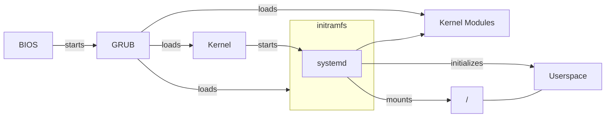

> [!info] Unterscheidet sich zwischen verschiedenen Distros.

1. [[BIOS]] startet den [[Linux]] [[Bootloader]] -> [[GRUB]] 
2. Laden des [[Kernel Image]] 
3. Laden der [[Initial RAM Disk|initrd]] mit [[Driver]]
4. [[Mount|Mounting]] der [[Filesystem|Filesysteme]]
5. Starten der Bootscripte -> [[systemd]]

![[Pasted image 20250331113152.png]]

## Aus der T1000 lol
