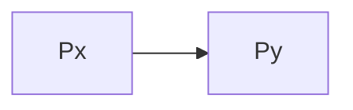

#klausurrelevant 

[[gerichteter Graph]]

- [[Prozess]]: Kreis
- [[Resource]]: Kaschden
- Hat der [[Graph]] einen [[Zyklus]] => [[Deadlock]] zwischen den [[Knoten]] des [[Zyklus]]

![[Pasted image 20250317104958.png]]

![[Pasted image 20250317105008.png]]

## Beispiel
![[Pasted image 20250317105030.png]]

# Vereinfachte Darstellung
> Welcher Prozess wartet auf welchen Prozess

Prozess X wartet auf Prozess Y

![[Pasted image 20250317105210.png]]

[[Zyklus]] -> [[Deadlock]]

> [!warning] Nur ein tatsächlicher [[Zyklus]] (eines gerichteten Graphen!!!!)