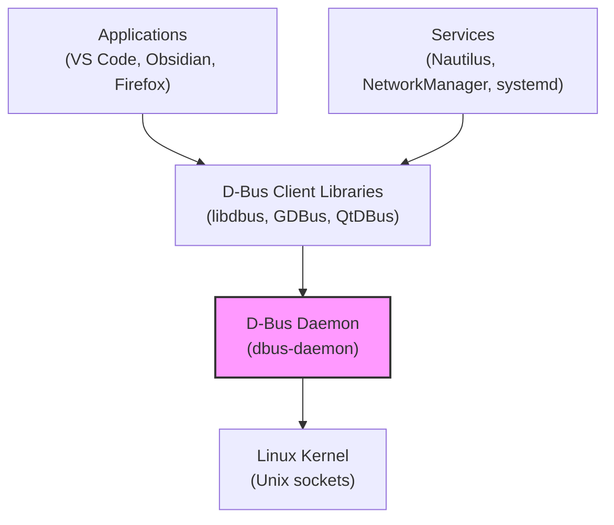

> Desktop [[BUS-System|Bus]]

-  Interface between userspace und kernel space
- Serves the [[Prozesskommunikation]]

> [!hint] Configured in `/usr/share/dbus-1/`

- somewhat like a [[Message Queue]], but messages are [[Prozess Blocking|blocking]] and consumed immediately -> [[BUS-System]]

[[Kernel]]

