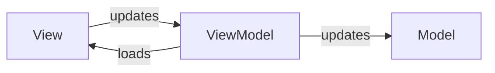

---
aliases:
  - MVVM
---
> Verbessert [[MVC]] indem die View vollständig entkoppelt wird

- basically was wir mit SPAs und so machen

> [!hint] Das [[Vue Model]] konzept ist ist ein [[View-ViewModel-Model|MVVM]].

