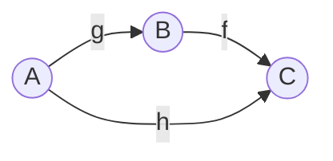

[[Associativity]], [[Category]], [[Identity Morphism]]

Two [[Morphism|Morphisms]] $f$ and $g$ can be composed if the source of $f$ is the target of $g$,

$$h:= f \circ g$$

> [!warning] Composition is [[Associativity|associative]], but not commutative!

## misusing type notation
$$g: A \longrightarrow B$$
$$f: B \longrightarrow C$$
$$\Longrightarrow f \circ b : A \longrightarrow C$$

