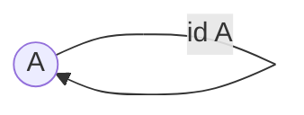

> A [[Morphism]] mapping an [[Object]] $A$ to itself.

$$id_{A}$$

> [!hint] The [[Identity Morphism]] is the [[Neutrales Element|neutral Element]] of [[Composition]].
> - if $f: A \longrightarrow B$, then:
> 	- $f \circ id_{B} = f$
> 	- $id_{A} \circ f = f$
> - => **it follows**: $id_{A} \circ id_{A} = id_{A}$

