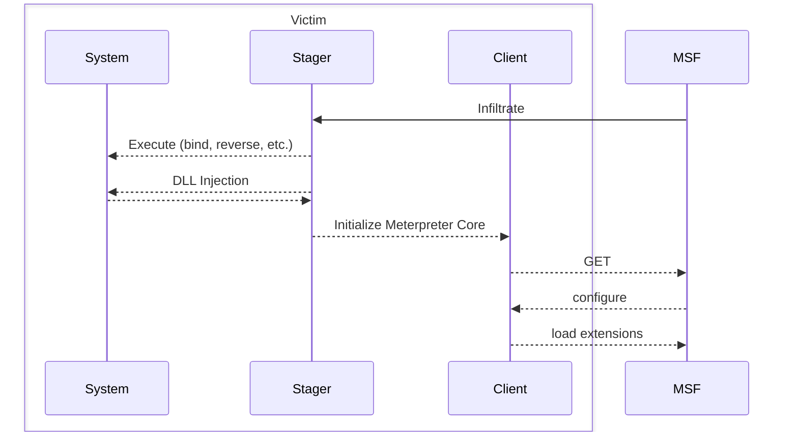

> A sophisticated [[MSF Payload|Payload]] system to (I **think**) perform Operations on a victim


- Focus on stealthiness by living only in [[Memory]] -> nothing written to disk, making forensic operations more difficult
- From what I can tell it basically serves as a bash-like interface around the victim





## Upgrade Shell Session
```shell
msf> sessions -u <id>
```

- upgrades most [[Shell]] sessions to meterpreter sessions yeeee